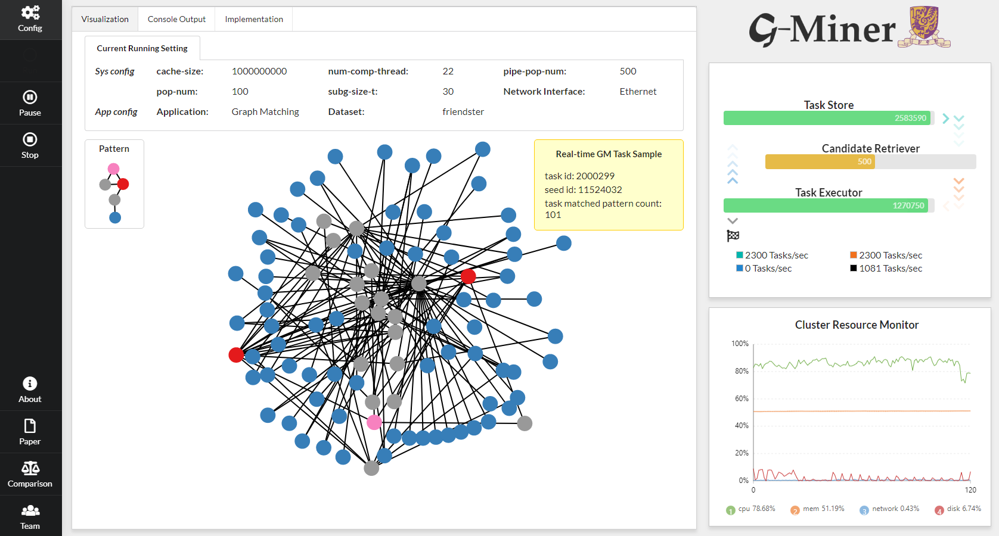

# G-Miner

G-Miner is a general distributed system aimed at graph mining over large-scale graphs.

Graph mining is one of the most important areas in data mining. However, scalable solutions for graph mining are still lacking as existing studies focus on sequential algorithms. While many distributed graph processing systems have been proposed in recent years, most of them were designed to parallelize computations such as PageRank and Breadth-First Search that keep states on individual vertices and propagate updates along edges. Graph mining, on the other hand, may generate many subgraphs whose number can far exceed the number of vertices. This inevitably leads to much higher computational and space complexity rendering existing graph systems inefficient. We propose G-Miner, a distributed system with a new architecture designed for general graph mining. G-Miner adopts a unified programming framework for implementing a wide range of graph mining algorithms. We model subgraph processing as independent tasks, and design a novel task pipeline to streamline task processing for better CPU, network and I/O utilization.


## Feature Highlights

- **General Graph Mining Schema:** G-Miner aims to provide a unified programming framework for implementing distributed algorithms for a wide range of graph mining applications. To design this framework, we have summarized common patterns of existing graphmining algorithms.

- **Task Model:** G-Miner supports asynchronous execution of various types of operations (i.e., CPU, network, disk) and efficient load balancing by modeling a graph mining job as a set of independent tasks. A task consists of three fields: sub-graph, candidates and context.

- **Task-Pipeline:** G-Miner provides the task-pipeline, which is designed to asyn-chronously process the following three major operations in G-Miner: (1) CPU computation to process the update operation on each task, (2) network communication to pull candidates from remote machines, and (3) disk writes/reads to buffer intermediate tasks on local disk of every machine.


## Getting Started

* **Dependencies Install**

To install G-Miner's dependencies (G++, MPI, JDK, HDFS), please follow the instructions in our project [webpage](http://www.cse.cuhk.edu.hk/systems/gminer/deploy.html).

* **Build**

Please manually MODIFY the dependency path for MPI and HDFS in CMakeLists.txt in root directory.

```bash
$ export GMINER_HOME=/path/to/gminer_root  # must configure this ENV
$ cd $GMINER_HOME
$ ./auto-build.sh
```

* [**Tutorials**](docs/TUTORIALS.md)

## Web Demo
### Prerequisites
  * python 3.6
  * flask==0.12.2, argparse, mpi4py, psutil, numpy : `$> pip install -r $GMINER_HOME/python-requirements.txt`
  * all G-Miner dependencies described above

### Configuration
* `$GMINER_HOME/script/demo-env.sh`: to define the environment variables, e.g. the port of web server, the output path, etc.
* `$GMINER_HOME/web/machines.cfg`: to specify the machine configuration. Note that the last node in the machine.cfg will be the master node of GMiner. The master node is also where the web server is running.
* `$GMINER_HOME/web/ib_machines.cfg`: The machine configuration using infiniband devices, it should keep consistency with the machines.cfg, which means if you want to enable infiniband for G-Miner, the deployed machines should install IB.

### Start the web server
  We suppose you have built and run G-Miner successfully now (if not, please refer to **Build** and **Tutorials** steps above). Then, to run the following commands :
  ```bash
  $> cd $GMINER_HOME
  $> ./script/start_demo_server.sh
    * Serving Flask app "main"
  ```

  


## Academic Paper

[**EuroSys 2018**] [G-Miner: An Efficient Task-Oriented Graph Mining System](docs/G-Miner-Eurosys18.pdf). Hongzhi Chen, Miao Liu, Yunjian Zhao, Xiao Yan, Da Yan, James Cheng.

[**SIGMOD DEMO 2019**] [Large Scale Graph Mining with G-Miner](docs/GMiner\_SIGMOD19.pdf). Hongzhi Chen, Xiaoxi Wang, Chenghuan Huang, Juncheng Fang, Yifan Hou, Changji Li, James Cheng.

## Acknowledgement
Thanks Chenghuan Huang([Entityless](https://github.com/Entityless)) and Xiaoxi Wang([MintYiqingchen](https://github.com/MintYiqingchen)) a lot for their contributions on the G-Miner DEMO Project!


## License

Copyright 2019 Husky Data Lab, CUHK
